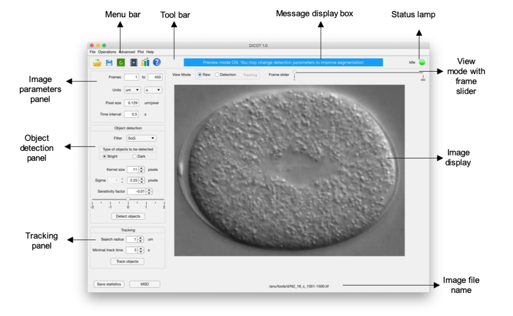

<p align="center">

</p>

__DICOT__, a MATLAB-based software developed for 2D particle tracking in DIC images  
Authors: Anushree Chaphalkar, [Yash Jawale](@ykjawale), Dhruv Khatri, Chaitanya Athale

[](https://www.gnu.org/licenses/gpl-3.0?style=for-the-badge)


<a href="https://github.com/CyCelsLab/DICOT/archive/master.zip"> <svg xmlns="http://www.w3.org/2000/svg" viewBox="0 0 24 24" width="24" height="24"><path d="M4.97 11.03a.75.75 0 111.06-1.06L11 14.94V2.75a.75.75 0 011.5 0v12.19l4.97-4.97a.75.75 0 111.06 1.06l-6.25 6.25a.75.75 0 01-1.06 0l-6.25-6.25zm-.22 9.47a.75.75 0 000 1.5h14.5a.75.75 0 000-1.5H4.75z"></path></svg>  </a> :microscope: :computer:

[DICOT cmd](https://github.com/CyCelsLab/DICOT_cmd) command-line version also available

### Reference
__Quantifying Intracellular Particle Flows by DIC Object Tracking (DICOT)__  
A. R. Chaphalkar, Y. K. Jawale, D. Khatri, and C. A. Athale  
DOI: [10.1016/j.bpj.2020.12.013](https://doi.org/10.1016/j.bpj.2020.12.013)

Links
 * [Source code](https://github.com/Self-OrganizationLab/DICOT)  
 * [CyCelS Software](http://www.iiserpune.ac.in/~cathale/?page_id=366)  

### Versions and requirements
Version `1.0.0`  
 * MATLAB R2019b or higher  
 * Toolboxes – Image Processing, Statistics, Curve Fitting  

### Installation
 * As a MATLAB App  
    <svg xmlns="http://www.w3.org/2000/svg" viewBox="0 0 16 16" width="16" height="16"><path fill-rule="evenodd" d="M7.47 10.78a.75.75 0 001.06 0l3.75-3.75a.75.75 0 00-1.06-1.06L8.75 8.44V1.75a.75.75 0 00-1.5 0v6.69L4.78 5.97a.75.75 0 00-1.06 1.06l3.75 3.75zM3.75 13a.75.75 0 000 1.5h8.5a.75.75 0 000-1.5h-8.5z"></path><a href="https://github.com/CyCelsLab/DICOT/archive/master.zip"></a></svg><a class="github-button" href="https://github.com/CyCelsLab/DICOT/archive/master.zip" data-icon="octicon-download" aria-label="Download CyCelsLab/DICOT on GitHub">Download</a> and run the `DICOT.mlappinstall` file on your machine. The DICOT app gets installed in the ‘_Apps_’ section of your MATLAB environment.
 * from source code :package:    
    Download the entire `DICOT` folder from GitHub and add it to your MATLAB `path`.
    Following command will open the DICOT interface.
    ```
    run dicot.mlapp
    ```
    Alternatively, you may open the interface directly by double clicking the `dicot.mlapp` file in the downloaded folder.  

-----

### User Guide

DICOT GUI looks like as following,
<p align="center">

<p>NOTE: Please resize or scroll the app in case it does not display optimally on your screen. </p>
</p>

__Workflow__
* Opening Image  
    * DICOT supports `TIFF` format
    * Open :open_file_folder: image files using,
    ```
    File > Open Image Series
    ```
* Image Parameters  
    * `Frames` frames to be analysed
    * `Units` unit of physical distance
    * `Pixel size` pixel-to-distance scaling factor
    * `Time interval` time interval between two consecutive image-frames
* Object Detection  
    Parameters
    * `Filter type` segmentation filter choice
    * `Object type` _White_ or _Black_ on background
    * `Kernel size` size of kernel (typically ≥ object size)
    * `Sigma` standard deviation of filter
    * `Sensitivity` tunes detection (for `SoG`)  
    
    Detection can be done using,
    ```
    Operations > Detect Objects
    ```
* Tracking  
    Parameters
    * `Search radius` a threshold distance for linking centroids (approximate distance moved by objects in between two frames)
    * `Minimum track time` only tracks spanning greater than threshold are retained  
    
    Tracking can be done using,
    ```
    Operations > Track Objects
    ```
* Quantification  :chart_with_upwards_trend:  
    Statistics :bar_chart: can be obtained using,
    ```
    Operations > Statistics
    ```
* Saving data :floppy_disk:  
    Images :page_with_curl: can be saved using,
    ```
    File > Save Image
    ```
    Movie :cinema: can be saved using,
    ```
    Operations > Make movie
    ```
    Parameters :memo: can be saved using,
    ```
    File > Save Parameters as > TYPE
    ```
* Reset :arrow_right_hook: parameters  
    Reset to default using button
* Help :grey_question:  
    Access `Help` using button
  
